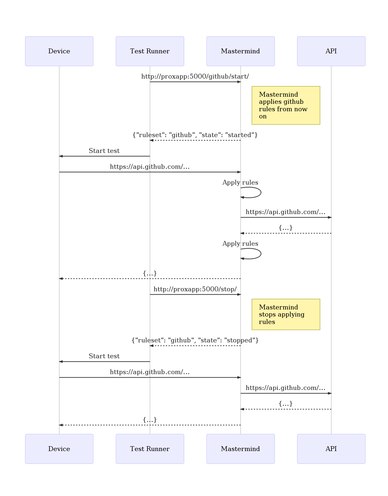

# Mastermind

Mastermind is written on top of the great [mitmproxy](https://mitmproxy.org)
to allow an easy way to intercept specific HTTP requests and mock its responses.

It has a complementary tool to easily switch the **OSX** proxy configuration.

[](https://circleci.com/gh/ustwo/mastermind)

## Requirements

* Python (tested with version 2.7).
* [pip](https://pypi.python.org/pypi/pip/).
* OSX if you want to use the proxyswitch.
* `xcode-select --install` if you use OSX.

If you plan to intercept HTTPS connections, check the [mitmproxy docs](http://docs.mitmproxy.org/en/stable/certinstall.html).


## Install

```sh
pip install "git+https://github.com/ustwo/mastermind.git@v0.8.1#egg=mastermind"
```

## Getting started

Mastermind is a CLI using `mitmproxy` that offers an easy way to define rules
to intercept HTTP(S) requests and mock its responses.  By default it makes sure
the OSX proxy settings are enabled only when the proxy is running.

The proxy runs by default on `http://localhost:8080`.

There are three modes you can use, "Driver", "Simple" and "Script".  They can't
be mixed.

**Note** Examples using `sudo` indicate you need high privileges to let
mastermind change the *system* proxy configuration.  If you run it with
`--without-proxy-settings` there is no need for special privileges.

### Troubleshooting

We collect non-obvious use cases at the [troubleshooting](./docs/troubleshooting.md) document.

### Driver

The driver mode will mount a thin HTTP server listening for actions at
`http://proxapp:5000` and a set of rules to apply.

Check the [Driver rules](./docs/rules.md) for a full list of properties.


```sh
sudo mastermind --with-driver \
                --source-dir $(pwd)/test/records
```

In the example above, `mastermind` will expect to find one or more YAML ruleset
files.  [Check the example](test/records).

A ruleset file is an array of rules and each rule is composed by at least a `url`.
The basic form will have a `body` as well.


```yaml
---
- url: https://api.github.com/users/octocat/orgs
  response:
    body: fake.json
```

A more elaborated case will have headers to add or remove:

```yaml
---
- name: bar
  url: https://api.github.com/users/arnau/orgs
  method: GET
  request:
    headers:
      remove:
        - 'If-None-Match'
  response:
    body: arnau-orgs.json
    headers:
      remove:
        - 'ETag'
      add:
        Cache-Control: no-cache
        X-ustwo-intercepted: 'Yes'
```

**Note**: Examples use `curl` which does not use the system proxy by default.
This is why the `--proxy` flag is used.  In contexts like Safari or XCode this
is implicit.

Assuming the two examples above were named `foo.yaml` and `bar.yaml` a running
`mastermind` in driver mode would load the first with:

```sh
$ curl --proxy http://localhost:8080 \
       -XGET http://proxapp:5000/foo/start/
```

Results in:

```json
{"driver": "foo", "state": "started"}
```

The second with:

```sh
$ curl --proxy http://localhost:8080 \
       -XGET http://proxapp:5000/bar/start/
```

Results in:

```json
{"driver": "bar", "state": "started"}
```

And cleaning any ruleset with:

```sh
$ curl --proxy http://localhost:8080 \
       -XGET http://proxapp:5000/stop/
```

Results in:

```json
{"driver": "bar", "state": "stopped"}
```

If you want to check what driver is being used, use `/state/`:

```sh
$ curl --proxy http://localhost:8080 \
       -XGET http://proxapp:5000/state/
```

Results in:

```json
{"driver": "bar", "state": "running"}
```

When no driver is running the response is `{"driver": null, "state": null}`.

**Note** URI without a trailing slash (`/`) will be redirected (301) to the
canonical ones with trailing slash.  If you use curl you might want to use the
`-L` flag.

In one picture:



#### Validation with JSON Schema

When a `schema` is present at the driver level the original resopnse will be
validated against the given JSON schema file.

See the [Driver validation](./docs/validation.md) documentation.


### Simple

The simple mode expects a response body filepath and a URL to intercept:

```sh
sudo mastermind --response-body $(pwd)/test/records/fake.json" \
                https://api.github.com/users/octocat/orgs
```

### Script

**Use this option if you *know* what you are doing**.

The script mode expects a mitmproxy Python script:

```sh
sudo mastermind --script $(pwd)/myscript.py
```

Or pass parameters to your script the same way mitmproxy does:

```sh
sudo mastermind --script "$(pwd)/myscript.py param1 param2"
```

If you go for the `--script` approach, you have to explicitly manage proxyswitch
yourself. Adding the following will do the trick:

```python
from proxyswitch import enable, disable

def start(context, argv):
    enable('127.0.0.1', '8080')

def done(context):
    disable()
```


Check the help for more.

```sh
mastermind --help
```


## Proxyswitch

CLI to switch on and off the OSX proxy configuration for HTTP and HTTPS. Check
the help:

```sh
proxyswitch --help
```


## Maintainers

* [Arnau Siches](mailto:arnau@ustwo.com)


## License

This is a proof of concept with no guarantee of active maintenance.

See [License](./LICENSE)
